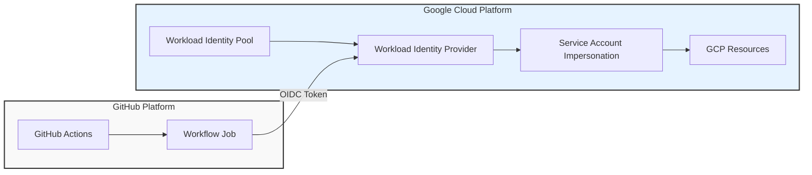
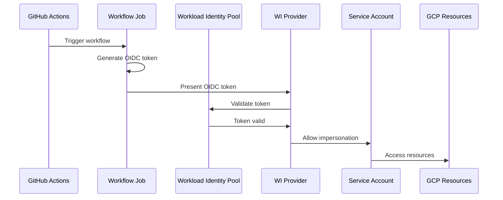
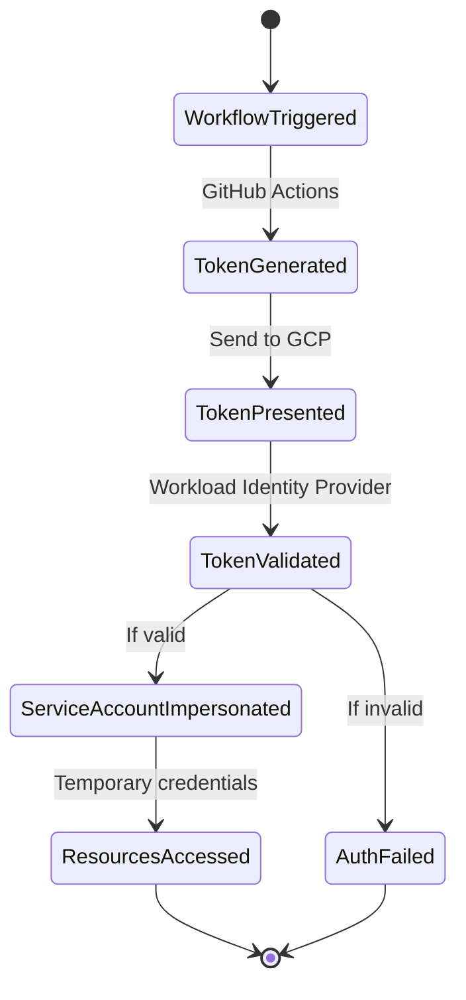

#OIDC

```bash
External Platform                 |                Google Cloud Platform
---------------------------------|------------------------------------------
                                 |
GitHub Actions                   |  Workload Identity Pool (github-actions)
  |                              |    |
  | issues OIDC token            |    | contains
  |                              |    |
  v                              |    v
Workflow Job ----token-----> Workload Identity Provider (github)
                                 |    |
                                 |    | validates & maps attributes
                                 |    |
                                 |    v
                                 |  Service Account Impersonation
                                 |    |
                                 |    | grants temporary access
                                 |    |
                                 |    v
                                 |  GCP Resources (Cloud Run, GKE, etc.)
```

## Mermaid Diagram Versions

### 1. Flowchart (LR - Left to Right)



### 2. Sequence Diagram



### 3. State Diagram

